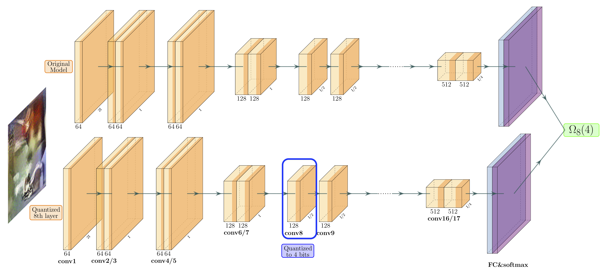

# ZeroQ: A Novel Zero Shot Quantization Framework



## Introduction

This repository contains the PyTorch implementation for the **CVPR 2020** paper [*ZeroQ: A Novel Zero-Shot Quantization Framework*](https://arxiv.org/abs/2001.00281). Below are instructions for reproducing classification results. Please see [detection readme](https://github.com/amirgholami/ZeroQ/tree/master/detection) for instructions to reproduce object detection results.

## TLDR;

```bash
# Code is based on PyTorch 1.2 (Cuda10). Other dependancies could be installed as follows: 
cd classification
pip install -r requirements.txt --user
# Set a symbolic link to ImageNet validation data (used only to evaluate model) 
mkdir data
ln -s /path/to/imagenet/ data/
```

The folder structures should be the same as following
```
zeroq
├── utils
├── data
│   ├── imagenet
│   │   ├── val
```
Afterwards you can test Zero Shot quantization with W8A8 by running:

```bash
bash run.sh
```

Below are the results that you should get for 8-bit quantization (**W8A8** refers to the quantizing model to 8-bit weights and 8-bit activations).


| Models                                          | Single Precision Top-1 | W8A8 Top-1 |
| ----------------------------------------------- | :--------------------: | :--------: |
| [ResNet18](https://arxiv.org/abs/1512.03385)    |          71.47         |   71.43    |
| [ResNet50](https://arxiv.org/abs/1512.03385)    |          77.72         |   77.67    |
| [InceptionV3](https://arxiv.org/abs/1512.00567) |          78.88         |   78.72    |
| [MobileNetV2](https://arxiv.org/abs/1801.04381) |          73.03         |   72.91    |
| [ShuffleNet](https://arxiv.org/abs/1707.01083)  |          65.07         |   64.94    |
| [SqueezeNext](https://arxiv.org/abs/1803.10615) |          69.38         |   69.17    |

## Evaluate

- You can test a single model using the following command:

```bash
export CUDA_VISIBLE_DEVICES=0
python uniform_test.py [--dataset] [--model] [--batch_size] [--test_batch_size]

optional arguments:
--dataset                   type of dataset (default: imagenet)
--model                     model to be quantized (default: resnet18)
--batch-size                batch size of distilled data (default: 64)
--test-batch-size           batch size of test data (default: 512)
```


## Citation
ZeroQ has been developed as part of the following paper. We appreciate it if you would please cite the following paper if you found the implementation useful for your work:

Y. Cai, Z. Yao, Z. Dong, A. Gholami, M. W. Mahoney, K. Keutzer. *ZeroQ: A Novel Zero Shot Quantization Framework*, under review [[PDF](https://arxiv.org/pdf/2001.00281.pdf)].


